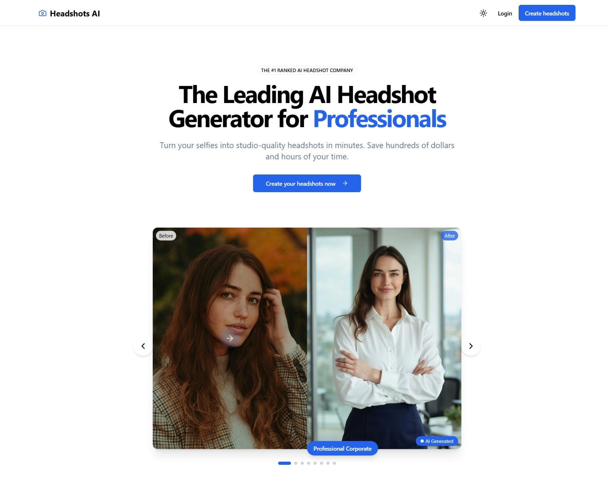

<div align="center">

# 🎯 Headshot AI

**Professional AI Headshots in Minutes**

*An open-source AI-powered headshot generator built with Next.js*

[](https://choosealicense.com/licenses/mit/)
[](https://nextjs.org/)
[](https://typescriptlang.org/)
[](https://supabase.com/)

[🚀 Live Demo](https://adonis.aiheadshots.click) • [📖 Documentation](#documentation) • [🛠️ Setup Guide](#quick-start) • [💬 Support](#support)

Contributors:
Jason Zhiqiang Pan |
Adel Kandi |
Anas Abbadi |
Wint Damhrung |
Quiel Andrew Castro



</div>

---

## ✨ Features

- 🎨 **AI-Powered Generation** - Create professional headshots using advanced AI models
- ⚡ **Lightning Fast** - Generate high-quality images in minutes, not hours  
- 🎯 **Multiple Styles** - Choose from various professional styles and themes
- 💳 **Flexible Pricing** - Credit-based system with Stripe integration
- 🔐 **Secure Authentication** - Magic link login via Supabase Auth
- 📱 **Responsive Design** - Works perfectly on desktop and mobile
- 🎪 **Pack System** - Curated prompt collections for consistent results
- 📊 **Real-time Updates** - Live progress tracking during model training

## 🛠️ Tech Stack

<div align="center">

| Category | Technology |
|----------|------------|
| **Frontend** | Next.js 14, React 18, TypeScript, Tailwind CSS |
| **Backend** | Next.js API Routes, Supabase |
| **AI/ML** | Astria.ai API, Flux Model Fine-tuning |
| **Database** | PostgreSQL (Supabase) |
| **Auth** | Supabase Auth (Magic Links) |
| **Storage** | Vercel Blob |
| **Payments** | Stripe |
| **Email** | Resend |
| **Deployment** | Vercel |

</div>

## 🚀 Quick Start

### Prerequisites

- Node.js 18+ 
- npm or yarn
- Astria.ai API key
- Supabase account
- Vercel account (for deployment)

### 1. Deploy with Vercel (Recommended)

Click the button below to deploy with pre-configured environment variables:

[](https://vercel.com/new/clone?repository-url=https%3A%2F%2Fgithub.com%2FPixelPeers%2Fpp-headshots-starter1&env=ASTRIA_API_KEY,APP_WEBHOOK_SECRET&envDescription=Set%20up%20environment%20variables%20for%20Astria%20AI%20and%20redirect%20URL%20in%20Supabase%20Auth%20dashboard.%20See%20.env.local.example%20for%20full%20config%20with%20Resend%20and%20Stripe.&project-name=headshots-starter-clone&repository-name=headshots-starter-clone&demo-title=AI%20Headshot%20Generator&demo-description=A%20Professional%20AI%20headshot%20generator%20starter%20kit%20powered%20by%20Next.js%20and%20Vercel)

### 2. Local Development Setup

```bash
# Clone the repository
git clone https://github.com/PixelPeers/pp-headshots-starter1.git
cd pp-headshots-starter1

# Install dependencies
npm install
# or
yarn install

# Copy environment variables
cp .env.local.example .env.local

# Start development server
npm run dev
# or 
yarn dev
```

Visit `http://localhost:3000` to see your application running!

## ⚙️ Configuration

### Essential Environment Variables

Create a `.env.local` file with the following variables:

```env
# Astria AI Configuration
ASTRIA_API_KEY=your_astria_api_key
APP_WEBHOOK_SECRET=your_webhook_secret
DEPLOYMENT_URL=https://your-domain.com

# Supabase Configuration  
NEXT_PUBLIC_SUPABASE_URL=your_supabase_url
NEXT_PUBLIC_SUPABASE_ANON_KEY=your_supabase_anon_key
SUPABASE_SERVICE_ROLE_KEY=your_service_role_key

# Vercel Blob Storage
BLOB_READ_WRITE_TOKEN=your_blob_token

# Optional: Pack API Configuration
NEXT_PUBLIC_TUNE_TYPE=packs  # or 'tune'
PACK_QUERY_TYPE=both  # 'users', 'gallery', or 'both'

# Optional: Stripe Integration
NEXT_PUBLIC_STRIPE_IS_ENABLED=true
STRIPE_SECRET_KEY=your_stripe_secret_key
STRIPE_WEBHOOK_SECRET=your_stripe_webhook_secret
STRIPE_PRICE_ID_ONE_CREDIT=price_xxx
STRIPE_PRICE_ID_THREE_CREDITS=price_xxx  
STRIPE_PRICE_ID_FIVE_CREDITS=price_xxx

# Optional: Email Notifications
RESEND_API_KEY=your_resend_api_key
```

### Database Setup

The Vercel deployment automatically sets up your Supabase database with the required tables:
- `credits` - User credit management
- `models` - AI model training records  
- `images` - Generated image references
- `samples` - Training image uploads

## 📁 Project Structure

```
├── app/                    # Next.js 14 App Router
│   ├── astria/            # Astria AI API integration
│   ├── auth/              # Authentication routes
│   ├── overview/          # Protected dashboard
│   └── stripe/            # Payment webhooks
├── components/            # React components
│   ├── ui/               # Shadcn/ui components
│   ├── homepage/         # Landing page sections
│   └── realtime/         # Live data components
├── lib/                  # Utility libraries
├── types/                # TypeScript definitions
└── supabase/            # Database migrations
```

## 🎨 Customization

### Adding New Prompt Packs

1. Configure pack mode in your environment:
```env
NEXT_PUBLIC_TUNE_TYPE=packs
PACK_QUERY_TYPE=both
```

2. Create packs via the Astria API documentation

### Styling Customization

The project uses Tailwind CSS with Shadcn/ui components. Customize the design by:

1. **Colors & Theme**: Edit `tailwind.config.ts`
2. **Components**: Modify files in `components/ui/`
3. **Global Styles**: Update `app/globals.css`

### Adding Payment Options

Configure additional Stripe products by:

1. Creating products in your [Stripe Dashboard](https://dashboard.stripe.com/products)
2. Adding price IDs to your environment variables
3. Updating the pricing table in `components/stripe/StripeTable.tsx`

## 📷 Getting Great Results


### Training Image Best Practices

- ✅ **Use close-up face shots** - Center the face in the frame
- ✅ **Single person only** - Avoid group photos  
- ✅ **Clear, well-lit images** - Good lighting is crucial
- ✅ **Consistent aspect ratio** - Use 1:1 (square) images
- ❌ **Avoid accessories** - No sunglasses, hats, or masks
- ❌ **No multiple faces** - Can cause distorted results

### Recommended Settings

- **Image Count**: 10-20 training images
- **Resolution**: 512x512 or 1024x1024  
- **Format**: JPG or PNG
- **File Size**: Under 5MB each

## 🚦 API Routes

| Endpoint | Method | Purpose |
|----------|--------|---------|
| `/astria/train-model` | POST | Start model training |
| `/astria/train-webhook` | POST | Handle training completion |
| `/astria/prompt-webhook` | POST | Handle image generation |
| `/astria/packs` | GET | Fetch available prompt packs |
| `/stripe/subscription-webhook` | POST | Process payments |

## 🤝 Contributing

We welcome contributions! Here's how to get started:

1. **Fork the repository**
2. **Create a feature branch**: `git checkout -b feature/amazing-feature`
3. **Make your changes** and test thoroughly
4. **Commit your changes**: `git commit -m 'Add amazing feature'`
5. **Push to your branch**: `git push origin feature/amazing-feature`  
6. **Open a Pull Request** targeting the `dev` branch

### Development Guidelines

- Follow existing code style and conventions
- Add TypeScript types for new features
- Test your changes locally before submitting
- Update documentation for significant changes

## 💡 Additional Use Cases

This platform can be adapted for various AI image generation applications:

- 🎭 **AI Avatars** - Custom character styles
- 🐕 **Pet Portraits** - Professional pet photography
- 📸 **Product Photography** - E-commerce imagery
- 🎨 **Style Transfer** - Consistent visual assets
- 🏢 **Brand Assets** - Logo variations and designs

## 📊 Performance & Scaling

- **Training Time**: 10-15 minutes per model
- **Generation Time**: 30-60 seconds per image
- **Concurrent Users**: Scales with Vercel/Supabase limits
- **Storage**: Handled by Vercel Blob (unlimited)
- **Database**: PostgreSQL with connection pooling

## 🐛 Troubleshooting

### Common Issues

**Webhook not working?**
- Ensure `DEPLOYMENT_URL` is not a Vercel preview URL
- Use ngrok for local development webhooks

**Model training fails?**
- Check image quality and format requirements
- Verify Astria API key and credits

**Authentication issues?**  
- Confirm Supabase URL configuration
- Check redirect URLs in Supabase dashboard

**Build errors?**
- Run `npm run build` to check for TypeScript errors
- Ensure all environment variables are set

## 📚 Documentation

- [Astria API Docs](https://docs.astria.ai/)
- [Next.js Documentation](https://nextjs.org/docs)
- [Supabase Docs](https://supabase.com/docs)
- [Stripe Integration Guide](https://stripe.com/docs/payments/checkout)

## 🏆 Support

- 🐛 **Bug Reports**: [GitHub Issues](https://github.com/PixelPeers/pp-headshots-starter1/issues)
- 💬 **Questions**: [GitHub Discussions](https://github.com/PixelPeers/pp-headshots-starter1/discussions)
- 📧 **General Support**: Create an issue for assistance

## 📝 License

This project is licensed under the MIT License - see the [LICENSE.md](LICENSE.md) file for details.

## 🙏 Acknowledgments

- [Astria.ai](https://astria.ai) for AI training capabilities
- [Vercel](https://vercel.com) for deployment platform
- [Supabase](https://supabase.com) for backend services
- [Shadcn](https://ui.shadcn.com) for UI components

---

<div align="center">

**Ready to generate amazing headshots?** 

[🚀 Deploy Now](https://vercel.com/new/clone?repository-url=https%3A%2F%2Fgithub.com%2FPixelPeers%2Fpp-headshots-starter1) • [⭐ Star this repo](https://github.com/PixelPeers/pp-headshots-starter1)

Built with ❤️ by developers, for developers

</div>
